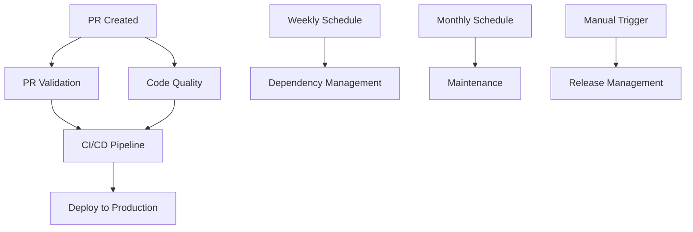

# GitHub Actions Workflows

This repository includes a comprehensive set of GitHub Actions workflows for automated CI/CD, quality assurance, and maintenance.

## 📋 Workflow Overview

### 🚀 [CI/CD Pipeline](./ci-cd.yml)

**Triggers:** Push to `main`/`develop`, Pull requests to `main`, Manual dispatch

**Purpose:** Complete continuous integration and deployment pipeline

**Features:**

- ✅ Quality checks (lint, format, type-check, tests)
- 🏗️ Build verification
- 🚀 Automatic production deployment to Vercel
- 📝 Automatic URL updates in configuration files
- 📊 Test coverage reporting

**Required Secrets:**

- `VERCEL_TOKEN`
- `VERCEL_ORG_ID`
- `VERCEL_PROJECT_ID`

---

### 🔍 [Code Quality](./code-quality.yml)

**Triggers:** Pull requests to `main`, Manual dispatch

**Purpose:** Advanced code quality analysis

**Features:**

- 📊 Bundle analysis
- 🧮 Code complexity metrics
- 📈 Performance analysis
- 📋 Detailed reporting

---

### 📦 [Dependency Management](./dependency-management.yml)

**Triggers:** Weekly schedule (Mondays 9 AM UTC), Manual dispatch

**Purpose:** Proactive dependency monitoring

**Features:**

- 🔒 Security vulnerability auditing
- 📋 Outdated package detection
- 📊 Automated reporting
- 🗓️ Weekly maintenance schedules

---

### 🧹 [Automated Maintenance](./maintenance.yml)

**Triggers:** Monthly schedule (1st of month, 6 AM UTC), Manual dispatch

**Purpose:** Repository housekeeping and reporting

**Features:**

- 🧹 Cleanup old build artifacts
- 📊 Generate project statistics
- 📋 Monthly health reports
- 🗂️ Archive management

---

### ✅ [PR Validation](./pr-validation.yml)

**Triggers:** Pull request events (opened, synchronize, reopened)

**Purpose:** Automated pull request validation

**Features:**

- 📝 Conventional commit title validation
- 🏗️ Project structure verification
- 🔒 Security scanning for sensitive files
- ⚠️ Hardcoded secret detection

---

### 🏷️ [Release Management](./release.yml)

**Triggers:** Manual dispatch with version type selection

**Purpose:** Automated release creation and versioning

**Features:**

- 🏷️ Semantic version bumping (patch/minor/major)
- 📝 Automatic changelog generation
- 🚀 GitHub release creation
- ✅ Full test suite validation

**Usage:**

```bash
# Manually trigger via GitHub Actions UI with:
# - Version type: patch|minor|major
# - Release notes (optional)
```

## 🔧 Setup Requirements

### 1. Repository Secrets

Configure these secrets in your GitHub repository settings:

```bash
VERCEL_TOKEN=your_vercel_token
VERCEL_ORG_ID=your_organization_id
VERCEL_PROJECT_ID=your_project_id
```

### 2. Repository Permissions

Ensure the repository has these permissions enabled:

- ✅ Contents: Write
- ✅ Pull requests: Write
- ✅ Deployments: Write
- ✅ Checks: Write
- ✅ Statuses: Write

### 3. Branch Protection (Recommended)

Configure branch protection rules for `main`:

- ✅ Require status checks to pass
- ✅ Require branches to be up to date
- ✅ Require pull request reviews
- ✅ Dismiss stale reviews when new commits are pushed

## 🛡️ Security Features

### Action Pinning

All actions are pinned to specific commit hashes for security:

```yaml
uses: actions/checkout@692973e3d937129bcbf40652eb9f2f61becf3332 # v4.1.7
```

### Minimal Permissions

Each workflow uses least-privilege permissions:

```yaml
permissions:
  contents: read
  pull-requests: write
```

### Secure Environment Handling

User-controlled data is handled safely:

```yaml
env:
  PR_TITLE: ${{ github.event.pull_request.title }}
```

## 📊 Monitoring & Reports

### Workflow Artifacts

- 📊 Test coverage reports (7 days retention)
- 🔒 Security audit reports (7 days retention)
- 📦 Dependency analysis (7 days retention)
- 📋 Monthly project reports (30 days retention)

### Step Summaries

Each workflow provides detailed summaries in the GitHub Actions UI:

- ✅ Quality check results
- 🚀 Deployment URLs
- 📊 Analysis metrics
- ⚠️ Security findings

## 🔄 Workflow Dependencies



## 🚀 Quick Start

1. **First Deployment:**

   ```bash
   git push origin main  # Triggers CI/CD pipeline
   ```

2. **Create a Release:**
   - Go to Actions → Release Management → Run workflow
   - Select version type and add release notes
   - Workflow handles the rest automatically

3. **Monitor Dependencies:**
   - Weekly reports appear in Actions tab
   - Check for security vulnerabilities and updates

4. **Create Pull Request:**
   - Use conventional commit format: `feat: add new feature`
   - PR validation runs automatically
   - All checks must pass before merge

## 🎯 Best Practices

### Commit Messages

Use conventional commits for automatic changelog generation:

```bash
feat: add new feature
fix: resolve bug in authentication
docs: update README
style: fix formatting
refactor: improve code structure
test: add unit tests
chore: update dependencies
```

### Development Workflow

1. Create feature branch from `main`
2. Make changes with conventional commits
3. Open PR to `main`
4. Address any workflow failures
5. Merge after approval and passing checks
6. Production deployment happens automatically

### Security Maintenance

- 🔄 Review weekly dependency reports
- 🔍 Address security vulnerabilities promptly
- 📋 Check monthly maintenance reports
- 🔒 Monitor for hardcoded secrets in PRs

---

_Last updated: $(date)_
_Workflows version: 1.0.0_
