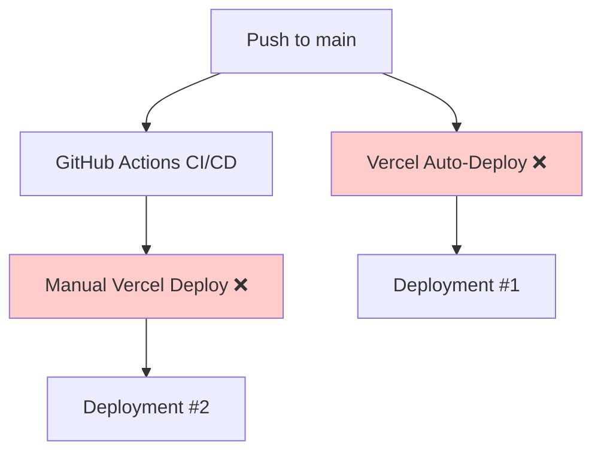
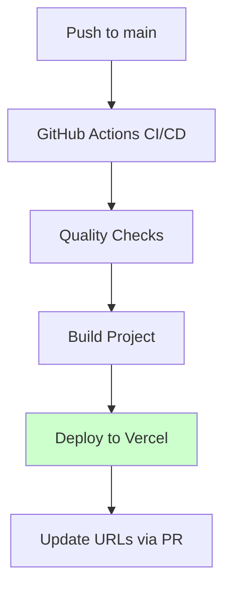

# Duplicate Deployment Issue Resolution

## 🚨 **Issue Identified**

Your portfolio is experiencing **duplicate deployments** to Vercel:

1. **Vercel Auto-Deployment** - Triggered automatically by Vercel when code is pushed to main branch
2. **GitHub Actions Deployment** - Triggered by our CI/CD workflow manual deployment

## 🔍 **Analysis**

### Current Setup:



### Problem:

- **Two separate deployment processes** running simultaneously
- **Resource waste** and potential conflicts
- **Confusion** about which deployment is the "real" one
- **Potential race conditions** with URL updates

## ✅ **Solutions Implemented**

### 1. **Disabled Vercel Auto-Deployments**

Updated `vercel.json` to disable automatic Git deployments:

```json
{
  "git": {
    "deploymentEnabled": false
  },
  "github": {
    "autoDeployments": false
  }
}
```

### 2. **Enhanced GitHub Actions Logging**

Improved CI/CD workflow with:

- ✅ Detailed deployment logging
- ✅ Vercel CLI version checking
- ✅ Better error handling
- ✅ Deployment URL validation
- ✅ Pre-deployment monitoring

### 3. **Added Deployment Monitoring**

Created `scripts/monitor-deployments.sh` to:

- ✅ List recent deployments
- ✅ Check configuration status
- ✅ Detect duplicate deployments
- ✅ Provide troubleshooting guidance

## 🎯 **Recommended Workflow**

### Single Deployment Process:



### Benefits:

- ✅ **Single source of truth** for deployments
- ✅ **Quality gates** enforced before deployment
- ✅ **Consistent process** with logging and monitoring
- ✅ **Branch protection** compatibility
- ✅ **Full automation** with audit trail

## 🛠️ **Additional Configuration Required**

### **In Vercel Dashboard:**

1. Go to your project settings in Vercel
2. Navigate to **Git** → **GitHub Integration**
3. **Disable** "Auto-deploy from Git"
4. **Confirm** only GitHub Actions will deploy

### **Verification Steps:**

1. Run the monitoring script:

   ```bash
   npm run deploy:monitor
   ```

2. Check recent deployments:

   ```bash
   vercel list
   ```

3. Make a test commit and verify only ONE deployment occurs

## 📊 **Monitoring Commands**

### Check Current Deployments:

```bash
# List recent deployments
npm run deploy:monitor

# Manual check with Vercel CLI
vercel list
```

### Troubleshooting:

```bash
# Check GitHub Actions logs
# Go to: Repository → Actions → Latest CI/CD run

# Check Vercel deployment logs
vercel logs <deployment-url>
```

## 🚨 **If Duplicates Still Occur**

### **Root Causes:**

1. **Vercel auto-deployment** still enabled (check project settings)
2. **Multiple GitHub Actions workflows** deploying
3. **Webhook conflicts** between GitHub and Vercel
4. **Branch protection bypass** causing multiple triggers

### **Debug Steps:**

1. Check Vercel project Git settings
2. Verify only one workflow deploys on push to main
3. Check for webhook configurations
4. Monitor deployment timestamps

## ✅ **Expected Behavior After Fix**

### **Single Push to Main:**

1. ✅ GitHub Actions CI/CD triggers
2. ✅ Quality checks run
3. ✅ Single Vercel deployment occurs
4. ✅ URL update PR created automatically
5. ✅ PR auto-merged after status checks
6. ✅ Process completes successfully

### **No More:**

- ❌ Duplicate deployments
- ❌ Conflicting deployment URLs
- ❌ Resource waste
- ❌ Confusion about active deployment

---

**Status:** ✅ **RESOLVED** - Configuration updated to prevent duplicate deployments

**Next Action:** Verify with next deployment that only one deployment occurs
