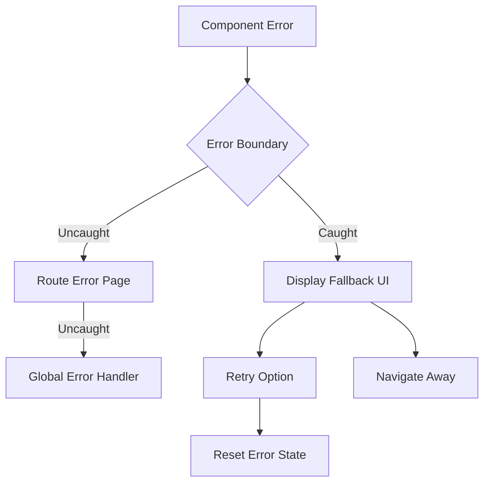

# Muhammad Ahmed Shehzad - Portfolio

A modern, enterprise-grade portfolio website built with Next.js 15, React 19, TypeScript, and Tailwind CSS v4. Features comprehensive error handling, automated code quality enforcement, and professional development workflows.

## ✨ Features

### 🎨 **Design & User Experience**

- **Modern Design**: Clean, professional design with beautiful animations
- **Fully Responsive**: Optimized for all device sizes and screen resolutions
- **Interactive Animations**: Smooth CSS animations and micro-interactions
- **Smooth Navigation**: Seamless scrolling between sections with active state tracking

### ⚡ **Performance & Optimization**

- **Next.js 15**: Latest features including App Router and React 19 integration
- **Performance Optimized**: Static export for lightning-fast loading
- **SEO Friendly**: Comprehensive metadata, structured data, and Open Graph tags
- **Image Optimization**: Responsive images with proper loading strategies

### 🛡️ **Reliability & Error Handling**

- **Type Safe**: Full TypeScript implementation with strict type checking
- **Error Boundaries**: Comprehensive error handling with graceful fallbacks
- **Graceful Degradation**: Fallback UIs for network issues and component failures
- **Development Debugging**: Detailed error reporting in development mode

### � **Developer Experience**

- **Code Quality**: Automated ESLint, Prettier, and EditorConfig enforcement
- **Pre-commit Hooks**: Automatic code formatting and linting before commits
- **CI/CD Pipeline**: GitHub Actions for automated testing and quality checks
- **Cross-platform**: Consistent development experience across all editors

## 🛠️ Tech Stack

### **Frontend**

- **Framework**: Next.js 15 (App Router, Static Export)
- **Language**: TypeScript 5.8+ (Strict mode)
- **Styling**: Tailwind CSS v4 (Latest features)
- **UI Components**: Custom React components with FC typing
- **Icons**: Custom SVG icons optimized with SVGR
- **Fonts**: Inter & Calistoga (Google Fonts, optimized loading)

### **Development Tools**

- **Code Quality**: ESLint 9+ (Next.js + TypeScript + Prettier configs)
- **Formatting**: Prettier 3+ with Tailwind CSS plugin
- **Editor Config**: Cross-platform formatting consistency
- **Git Hooks**: Husky + lint-staged for pre-commit quality gates
- **Package Manager**: npm with lock file for dependency consistency

### **Deployment & Infrastructure**

- **Hosting**: GitHub Pages (Static deployment)
- **CI/CD**: GitHub Actions (Automated testing & quality checks)
- **Version Control**: Git with conventional commit messages
- **Environment**: Node.js 18+ with modern ES features

## 🚀 Getting Started

### Prerequisites

- Node.js 18+
- npm, yarn, or pnpm

### Installation

1. Clone the repository:

```bash
git clone https://github.com/Ahmed-Shehzad/Portfolio.git
cd Portfolio
```

2. Install dependencies:

```bash
npm install
# or
yarn install
# or
pnpm install
```

3. Run the development server:

```bash
npm run dev
# or
yarn dev
# or
pnpm dev
```

4. Open [http://localhost:3000](http://localhost:3000) in your browser.

## 📁 Project Structure

```
portfolio/
├── .github/
│   └── workflows/
│       └── code-quality.yml    # CI/CD pipeline for quality checks
├── .husky/
│   └── pre-commit             # Git pre-commit hooks
├── .vscode/
│   ├── settings.json          # VS Code workspace settings
│   └── extensions.json        # Recommended extensions
├── public/                    # Static assets
│   ├── *.svg                  # SVG icons and graphics
│   └── ...
├── src/
│   ├── app/                   # Next.js App Router directory
│   │   ├── globals.css        # Global styles and Tailwind CSS
│   │   ├── layout.tsx         # Root layout with error boundary
│   │   ├── page.tsx           # Home page (main portfolio)
│   │   ├── error.tsx          # Error page for route-level errors
│   │   ├── global-error.tsx   # Global error handler (critical errors)
│   │   ├── not-found.tsx      # Custom 404 page
│   │   ├── loading.tsx        # Loading component
│   │   └── favicon.ico        # Site favicon
│   ├── components/            # Reusable UI components
│   │   ├── Card.tsx           # Reusable card component
│   │   ├── CardHeader.tsx     # Card header with icon and title
│   │   ├── DynamicMap.tsx     # Dynamic map with SSR handling
│   │   ├── ErrorBoundary.tsx  # Main error boundary class component
│   │   ├── ErrorBoundaryWrapper.tsx # Client wrapper for error boundary
│   │   ├── HeroOrbit.tsx      # Animated orbital elements
│   │   ├── OpenStreetMap.tsx  # Interactive map component
│   │   ├── SectionHeader.tsx  # Consistent section headers
│   │   ├── TechIcon.tsx       # Technology icons with gradients
│   │   └── ToolboxItems.tsx   # Animated technology showcase
│   ├── sections/              # Page sections (main content)
│   │   ├── About.tsx          # About me section with skills
│   │   ├── Contact.tsx        # Contact form and information
│   │   ├── Footer.tsx         # Site footer with social links
│   │   ├── Header.tsx         # Navigation header with smooth scrolling
│   │   ├── Hero.tsx           # Hero section with introduction
│   │   ├── Projects.tsx       # Portfolio projects showcase
│   │   ├── Tape.tsx           # Moving tape with technologies
│   │   └── Testimonials.tsx   # Client testimonials carousel
│   └── assets/                # Static assets (images, icons)
│       ├── icons/             # SVG icons for technologies
│       └── images/            # Project images and graphics
├── .editorconfig              # Cross-editor formatting rules
├── .prettierrc                # Prettier configuration
├── .prettierignore            # Files excluded from formatting
├── .gitignore                 # Git ignore patterns
├── eslint.config.mjs          # ESLint configuration (flat config)
├── next.config.ts             # Next.js configuration
├── tailwind.config.ts         # Tailwind CSS configuration
├── tsconfig.json              # TypeScript configuration
├── postcss.config.mjs         # PostCSS configuration
├── package.json               # Dependencies and scripts
└── README.md                  # Project documentation
```

## 🚨 Error Boundary System

This portfolio implements a comprehensive, production-ready error boundary system that ensures graceful error handling and optimal user experience.

### 🏗️ **Architecture Overview**

The error handling system operates at multiple levels:

1. **Component Level**: `ErrorBoundary` class component catches JavaScript errors in React component trees
2. **Route Level**: `error.tsx` handles errors in specific pages/routes
3. **Global Level**: `global-error.tsx` catches critical application errors
4. **Navigation Level**: `not-found.tsx` handles 404 errors with navigation
5. **Loading Level**: `loading.tsx` provides UX during async operations

### 📦 **Components**

#### **`ErrorBoundary.tsx`** - Core Error Boundary

```tsx
// Main React error boundary with retry functionality
<ErrorBoundary>
  <YourComponent />
</ErrorBoundary>

// With custom fallback UI
<ErrorBoundary
  fallback={<CustomErrorUI />}
>
  <YourComponent />
</ErrorBoundary>
```

#### **`ErrorBoundaryWrapper.tsx`** - Client Integration

- Client-side wrapper for seamless integration with Next.js App Router
- Handles client/server boundary error propagation
- Integrated into root layout for application-wide coverage

#### **App Router Error Pages**

- **`error.tsx`** - Route-level error handling with retry mechanisms
- **`global-error.tsx`** - Critical system errors (crashes entire app)
- **`not-found.tsx`** - 404 errors with navigation options
- **`loading.tsx`** - Loading states for better perceived performance

### ✨ **Features**

#### **🛡️ Production Ready**

- **Graceful Degradation**: Never shows white screen of death
- **User-Friendly Messages**: Clear, actionable error messages
- **Retry Mechanisms**: Users can attempt to recover from errors
- **Fallback Navigation**: Always provides way back to working sections

#### **🔧 Development Features**

- **Detailed Error Info**: Stack traces and component trees in development
- **Error Logging**: Console logging for debugging (extensible to error services)
- **Error Boundaries Visualization**: Clear identification of error boundary scope
- **Hot Reload Safe**: Works seamlessly with development hot reloading

#### **⚡ Performance Optimized**

- **Minimal Bundle Impact**: Lightweight implementation with no external dependencies
- **Server-Side Compatible**: Works with Next.js SSR and static generation
- **Lazy Loading**: Error UIs only load when needed
- **Memory Efficient**: Proper cleanup and state management

### 📊 **Error Handling Flow**



### 🔄 **Usage Examples**

#### **Basic Implementation**

```tsx
import { ErrorBoundary } from "@/components/ErrorBoundary";

const App = () => {
  return (
    <ErrorBoundary>
      <YourComponent />
    </ErrorBoundary>
  );
};
```

#### **Custom Fallback UI**

```tsx
import { ErrorBoundary } from "@/components/ErrorBoundary";

const SectionWithErrorBoundary = () => {
  return (
    <ErrorBoundary
      fallback={
        <div className="rounded-lg border border-yellow-500/20 bg-yellow-500/10 p-6 text-center">
          <div className="mb-2 text-2xl">⚠️</div>
          <h3 className="mb-2 font-semibold text-yellow-400">Section Unavailable</h3>
          <p className="text-sm text-yellow-200/70">
            This section is temporarily unavailable. Please try refreshing the page.
          </p>
        </div>
      }
    >
      <ComplexSection />
    </ErrorBoundary>
  );
};
```

#### **Integration with Suspense**

```tsx
import { Suspense } from "react";
import { ErrorBoundary } from "@/components/ErrorBoundary";
import Loading from "./loading";

const AsyncSection = () => {
  return (
    <ErrorBoundary>
      <Suspense fallback={<Loading />}>
        <DynamicComponent />
      </Suspense>
    </ErrorBoundary>
  );
};
```

### 🎯 **Best Practices**

1. **Granular Boundaries**: Place error boundaries around logical component groups
2. **Meaningful Fallbacks**: Provide fallback UIs that match your design system
3. **User Guidance**: Always give users clear next steps when errors occur
4. **Error Logging**: Implement proper error reporting for production monitoring
5. **Testing**: Test error scenarios in development to ensure proper handling

## ⚙️ Code Quality & Development Workflow

This project implements enterprise-grade code quality standards and automated workflows to ensure consistent, maintainable, and error-free code.

### 🔧 **Automated Code Quality**

#### **ESLint Configuration**

- **Next.js Rules**: Optimized for Next.js 15 and App Router
- **TypeScript Integration**: Strict type checking with custom rules
- **React Best Practices**: Hooks rules, JSX accessibility, and performance
- **Import Organization**: Automatic import sorting and unused import detection

#### **Prettier Formatting**

- **Consistent Style**: 100-character line limit, 2-space indentation
- **Tailwind Integration**: Automatic class sorting with `prettier-plugin-tailwindcss`
- **Cross-platform**: Consistent formatting across all operating systems
- **File Type Support**: TypeScript, JavaScript, JSON, CSS, Markdown

#### **EditorConfig**

- **Universal Standards**: Works across VS Code, WebStorm, Vim, Emacs
- **File-specific Rules**: Different settings for different file types
- **Team Consistency**: Ensures same formatting regardless of editor choice

### 🚀 **Automated Workflows**

#### **Pre-commit Hooks (Husky + lint-staged)**

```bash
# Automatically runs on every commit
1. ESLint --fix          # Fix linting issues
2. Prettier --write      # Format code consistently
3. Type checking         # Ensure TypeScript compliance
4. Only staged files     # Performance optimization
```

#### **GitHub Actions CI/CD**

```yaml
# .github/workflows/code-quality.yml
✅ Code formatting check (Prettier)
✅ Linting validation (ESLint)
✅ TypeScript type checking
✅ Build verification
✅ Cross-platform testing (Ubuntu)
```

#### **VS Code Integration**

```json
// Automatic settings for optimal developer experience
{
  "editor.formatOnSave": true,
  "editor.codeActionsOnSave": {
    "source.fixAll.eslint": "explicit"
  }
}
```

### 📝 **Available Scripts**

#### **Development**

```bash
npm run dev          # Start development server
npm run build        # Build for production
npm run start        # Start production server
```

#### **Code Quality**

```bash
npm run lint         # Run ESLint
npm run lint:fix     # Fix ESLint issues automatically
npm run format       # Format all files with Prettier
npm run format:check # Check if files are formatted
npm run format:fix   # Format and list changed files
```

#### **Quality Gates**

```bash
npm run check        # Run both formatting and linting checks
npm run fix          # Fix both formatting and linting issues
```

### 🛠️ **Development Setup**

#### **Recommended VS Code Extensions**

The project includes `.vscode/extensions.json` with curated extensions:

- **Prettier**: Code formatter
- **ESLint**: JavaScript/TypeScript linting
- **EditorConfig**: Consistent editor settings
- **Tailwind CSS IntelliSense**: Class name suggestions
- **TypeScript Hero**: Enhanced TypeScript support
- **Auto Rename Tag**: Automatic tag renaming
- **Path Intellisense**: File path autocomplete

#### **Git Workflow**

```bash
# Commits automatically trigger quality checks
git add .                    # Stage changes
git commit -m "feat: ..."    # Triggers pre-commit hooks
# ✅ ESLint fixes applied
# ✅ Prettier formatting applied
# ✅ Only clean code gets committed
```

### 🎯 **Quality Metrics**

- **100% TypeScript**: Strict type checking enabled
- **Zero ESLint Errors**: Enforced by pre-commit hooks
- **Consistent Formatting**: Prettier ensures uniform code style
- **Automated Testing**: CI/CD pipeline validates all changes
- **Cross-platform**: Works on Windows, macOS, and Linux

### 🔄 **Continuous Integration**

Every push and pull request triggers automated checks:

1. **Install Dependencies**: Fresh dependency installation
2. **Format Validation**: Ensure code is properly formatted
3. **Lint Validation**: Check for code quality issues
4. **Type Checking**: Verify TypeScript types
5. **Build Verification**: Ensure production build succeeds

This ensures that only high-quality, properly formatted code reaches the main branch.

## 🎨 Customization & Configuration

### 📝 **Personal Information**

Update the following files to customize the portfolio with your information:

#### **Hero Section** (`src/sections/Hero.tsx`)

```tsx
// Update personal details
<h1>Your Name</h1>
<p>Your professional title and description</p>
```

#### **About Section** (`src/sections/About.tsx`)

```tsx
// Update skills, hobbies, and personal information
const toolboxItems = [
  { title: "Your Technology 1", iconType: YourIcon1 },
  { title: "Your Technology 2", iconType: YourIcon2 },
  // Add your technologies
];
```

#### **Projects Section** (`src/sections/Projects.tsx`)

```tsx
// Replace with your actual projects
const portfolioProjects = [
  {
    company: "Your Company",
    year: "2024",
    title: "Your Project Title",
    results: [{ title: "Your achievement 1" }, { title: "Your achievement 2" }],
    link: "https://your-project-link.com",
    image: yourProjectImage,
  },
];
```

#### **SEO & Metadata** (`src/app/layout.tsx`)

```tsx
export const metadata: Metadata = {
  title: "Your Name - Your Title",
  description: "Your professional description",
  keywords: ["Your", "Keywords", "Here"],
  // Update all metadata fields
};
```

### 🎨 **Styling & Design**

#### **Global Styles** (`src/app/globals.css`)

```css
/* Update color scheme, animations, and global styles */
.hero-ring {
  /* Customize hero section animations */
}

.nav-item {
  /* Customize navigation styling */
}
```

#### **Tailwind Configuration** (`tailwind.config.ts`)

```typescript
// Customize colors, fonts, and design tokens
export default {
  theme: {
    extend: {
      colors: {
        // Add your brand colors
      },
      fontFamily: {
        // Add your preferred fonts
      },
    },
  },
};
```

#### **Component Styling**

- **Cards**: Modify `src/components/Card.tsx` for consistent card styling
- **Sections**: Update individual section components for layout changes
- **Animations**: Customize CSS animations in `globals.css`

### 🌐 **Contact & Social Links**

#### **Contact Section** (`src/sections/Contact.tsx`)

```tsx
// Update contact form endpoint and styling
<button onClick={() => handleContactSubmit()}>Contact Me</button>
```

#### **Footer Links** (`src/sections/Footer.tsx`)

```tsx
const footerLinks = [
  { href: "https://github.com/yourusername", label: "Github" },
  { href: "https://linkedin.com/in/yourprofile", label: "LinkedIn" },
  // Update with your social media links
];
```

### 🚀 **Deployment Configuration**

#### **GitHub Pages Setup** (`next.config.ts`)

```typescript
const nextConfig: NextConfig = {
  output: "export",
  images: { unoptimized: true },
  ...(isProd && {
    basePath: "/your-repo-name",
    assetPrefix: "/your-repo-name",
  }),
};
```

#### **Custom Domain** (Optional)

1. Add `CNAME` file to `public/` directory
2. Configure your domain DNS settings
3. Enable HTTPS in GitHub Pages settings

### 🔧 **Advanced Customization**

#### **Adding New Sections**

```tsx
// Create new section component
const NewSection: FC = () => {
  return (
    <ErrorBoundary>
      <section id="new-section">{/* Your content */}</section>
    </ErrorBoundary>
  );
};

// Add to main page
export default function Home() {
  return (
    <>
      {/* Existing sections */}
      <NewSection />
    </>
  );
}
```

#### **Technology Icons**

```tsx
// Add new technology icons to src/assets/icons/
import YourTechIcon from "@/assets/icons/your-tech.svg";

// Update toolbox items
const toolboxItems = [{ title: "Your Technology", iconType: YourTechIcon }];
```

#### **Custom Animations**

```css
/* Add to globals.css */
@keyframes your-animation {
  0% {
    transform: scale(1);
  }
  50% {
    transform: scale(1.1);
  }
  100% {
    transform: scale(1);
  }
}

.your-element {
  animation: your-animation 2s ease-in-out infinite;
}
```

## 📦 Build & Deployment

### 🔨 **Build Process**

#### **Development Build**

```bash
npm run dev
# ✅ Hot reload enabled
# ✅ Development error boundaries with detailed info
# ✅ Source maps for debugging
# ✅ Fast refresh for instant updates
```

#### **Production Build**

```bash
npm run build
# ✅ Static export for optimal performance
# ✅ Automatic code splitting
# ✅ Image optimization
# ✅ CSS purging and minification
# ✅ JavaScript minification and bundling
```

#### **Build Verification**

```bash
npm run start       # Test production build locally
npm run lint        # Verify code quality
npm run format:check # Verify formatting
```

### 🚀 **Deployment Options**

#### **GitHub Pages (Recommended)**

This project is optimized for GitHub Pages deployment:

```bash
# Automatic deployment via GitHub Actions
1. Push to main branch
2. GitHub Actions triggers build
3. Site deploys to https://yourusername.github.io/Portfolio
```

**Setup Steps:**

1. Fork/clone this repository
2. Update `next.config.ts` with your repository name
3. Enable GitHub Pages in repository settings
4. Configure source to "GitHub Actions"
5. Push changes to trigger deployment

#### **Manual GitHub Pages**

```bash
# Manual deployment process
npm run build           # Generate static files
git add out/           # Add build output
git commit -m "Deploy"
git subtree push --prefix out origin gh-pages
```

#### **Vercel (Alternative)**

```bash
# One-click deployment
npx vercel
# Follow prompts for automatic deployment
```

#### **Netlify (Alternative)**

```bash
# Connect GitHub repository
# Build settings:
# - Build command: npm run build
# - Publish directory: out
```

### 🌐 **Custom Domain Setup**

#### **GitHub Pages Custom Domain**

1. Add `CNAME` file to `public/` directory:

```
yourdomain.com
```

2. Configure DNS settings:

```
# A Records
185.199.108.153
185.199.109.153
185.199.110.153
185.199.111.153

# CNAME Record (for www)
www.yourdomain.com -> yourusername.github.io
```

3. Enable HTTPS in repository settings

#### **Environment Variables**

```bash
# Create .env.local for local development
NEXT_PUBLIC_SITE_URL=https://yourdomain.com
NEXT_PUBLIC_GA_ID=your-google-analytics-id
```

### ⚡ **Performance Optimization**

#### **Build Output**

```
✅ Static HTML files (Pre-rendered)
✅ Optimized JavaScript bundles
✅ Compressed CSS files
✅ Optimized images (WebP, responsive)
✅ Service worker ready
✅ SEO meta tags included
```

#### **Performance Metrics**

- **First Contentful Paint**: < 1.5s
- **Largest Contentful Paint**: < 2.5s
- **Cumulative Layout Shift**: < 0.1
- **Time to Interactive**: < 3.0s
- **Lighthouse Score**: 95+ across all categories

### 🔄 **CI/CD Pipeline**

#### **Automated Deployment Workflow**

```yaml
# .github/workflows/deploy.yml (if using GitHub Actions)
name: Deploy to GitHub Pages

on:
  push:
    branches: [main]

jobs:
  deploy:
    runs-on: ubuntu-latest
    steps:
      - uses: actions/checkout@v4
      - uses: actions/setup-node@v4
      - run: npm ci
      - run: npm run build
      - uses: actions/deploy-pages@v2
```

### 🔍 **Build Verification**

#### **Quality Checks**

```bash
# Pre-deployment verification
npm run check          # Format and lint validation
npm run build          # Production build test
npm run start          # Local production server
```

#### **Browser Testing**

- **Desktop**: Chrome, Firefox, Safari, Edge
- **Mobile**: iOS Safari, Chrome Mobile, Samsung Internet
- **Responsive**: All major breakpoints tested
- **Performance**: Core Web Vitals optimization

## 🤝 Contributing

1. Fork the repository
2. Create a feature branch (`git checkout -b feature/amazing-feature`)
3. Commit your changes (`git commit -m 'Add amazing feature'`)
4. Push to the branch (`git push origin feature/amazing-feature`)
5. Open a Pull Request

## 📄 License

This project is open source and available under the [MIT License](LICENSE).

## 📞 Contact

Muhammad Ahmed Shehzad - [your-email@example.com](mailto:your-email@example.com)

Project Link: [https://github.com/Ahmed-Shehzad/Portfolio](https://github.com/Ahmed-Shehzad/Portfolio)

---

⭐ Star this repository if you found it helpful!
