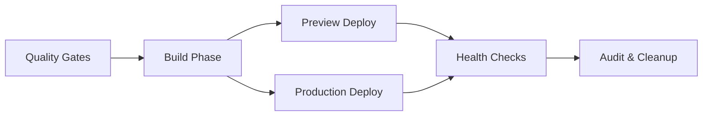

# CI/CD Update Summary - Vercel Prebuilt Migration

## ✅ Successfully Updated CI/CD Pipeline

This document summarizes the migration from the old Vercel deployment approach to the new prebuilt strategy.

### 🔄 What Changed

#### **Before (Old Approach)**

- Used `amondnet/vercel-action` GitHub Action
- Build and deploy happened in a single step
- Limited control over build artifacts
- Difficult to debug deployment issues

#### **After (New Approach)**

- Uses official Vercel CLI with `--prebuilt` flag
- **Separated build and deploy phases** for better reliability
- Build artifacts are cached and reused
- Better error handling and debugging capabilities

### 🏗️ New Workflow Structure



### 📋 Updated Files

#### **GitHub Workflows**

- ✅ `.github/workflows/vercel-deploy.yml` - Complete rewrite with prebuilt approach

#### **Package Scripts**

- ✅ Added `vercel:build` - Generate Vercel build output
- ✅ Added `vercel:build:prod` - Generate production build output
- ✅ Added `vercel:deploy` - Deploy using prebuilt artifacts
- ✅ Added `vercel:deploy:prod` - Deploy to production using prebuilt
- ✅ Added `deploy:preview` - Complete preview deployment workflow
- ✅ Added `deploy:production` - Complete production deployment workflow

#### **Deployment Automation**

- ✅ `scripts/deploy.sh` - Interactive deployment script with environment validation
- ✅ `docs/DEPLOYMENT_GUIDE.md` - Comprehensive deployment documentation
- ✅ Updated `README.md` - Added deployment section with quick reference

### 🚀 New Deployment Commands

#### **Automated (CI/CD)**

```bash
# Automatic on PR
git push origin feature-branch  # Triggers preview deployment

# Automatic on main
git push origin main           # Triggers production deployment
```

#### **Manual Local Deployment**

```bash
# Quick commands
npm run deploy:preview         # Build + deploy to preview
npm run deploy:production      # Build + deploy to production

# Step-by-step
npm run vercel:build          # Generate build artifacts
npm run vercel:deploy         # Deploy using prebuilt artifacts

# Using deployment script (recommended for first-time)
./scripts/deploy.sh preview   # Interactive preview deployment
./scripts/deploy.sh production # Interactive production deployment
```

### 🎯 Benefits Achieved

1. **🔧 Better Separation of Concerns**
   - Build phase validates code quality and generates artifacts
   - Deploy phase focuses solely on deployment

2. **🚀 Improved Reliability**
   - Pre-validated build artifacts reduce deployment failures
   - Consistent builds across environments

3. **⚡ Enhanced Performance**
   - No rebuild during deployment (faster deployments)
   - Cached build artifacts between jobs

4. **🐛 Easier Debugging**
   - Clear separation makes it easier to identify issues
   - Build artifacts can be inspected independently

5. **🔄 Better Control**
   - Same build can be deployed to multiple environments
   - Rollback capabilities with build artifacts

### 📊 CI/CD Pipeline Performance

#### **Job Dependencies**

```
Quality → Build → Preview (PR only)
               → Production (main only)
               → Audit → Cleanup
```

#### **Artifacts Generated**

- `vercel-build-output-{sha}` - Vercel deployment artifacts
- `nextjs-build-output-{sha}` - Next.js build output for debugging

### 🛡️ Environment Requirements

#### **Repository Secrets (Already Configured)**

- `VERCEL_TOKEN` - Vercel authentication token
- `VERCEL_ORG_ID` - Vercel organization ID
- `VERCEL_PROJECT_ID` - Vercel project ID

#### **Local Development (Optional)**

For local deployments, set these environment variables:

```bash
export VERCEL_TOKEN="your_token"
export VERCEL_ORG_ID="your_org_id"
export VERCEL_PROJECT_ID="your_project_id"
```

### 🧪 Testing & Validation

#### **Successful Tests Completed**

- ✅ Local build: `npm run build`
- ✅ Vercel build: `npm run vercel:build`
- ✅ Preview deployment: `npm run vercel:deploy`
- ✅ Production deployment: `vercel deploy --prebuilt --prod`

#### **URLs Generated**

- **Latest Preview**: https://portfolio-1a3in3pfv-muhammad-ahmed-shehzads-projects.vercel.app
- **Latest Production**: https://portfolio-mc5ykyozx-muhammad-ahmed-shehzads-projects.vercel.app

### 📚 Documentation

- **[Deployment Guide](docs/DEPLOYMENT_GUIDE.md)** - Complete deployment documentation
- **[README.md](README.md)** - Updated with deployment section
- **[scripts/deploy.sh](scripts/deploy.sh)** - Commented deployment script

### 🎉 Migration Complete!

The CI/CD pipeline has been successfully updated to use Vercel's prebuilt approach. The new system provides:

- ✅ Better reliability and error handling
- ✅ Clearer separation of build and deploy phases
- ✅ Enhanced debugging capabilities
- ✅ Improved performance and consistency
- ✅ Comprehensive documentation and tooling

**Next deployment will use the new pipeline automatically when you push to main or create a pull request.**
